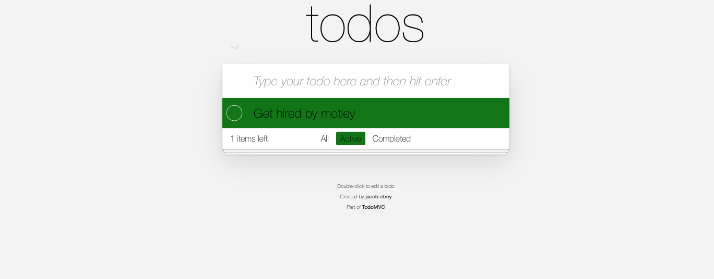

# Hooks TODO

## Table of contents

- [Description](#description)
- [Installation](#installation)
- [Usage](#usage)
- [License](#license)
- [Tests](#tests)
- [Deployed Site](#deployed-site)
- [Questions](#questions)
- [Template](#template)
- [Explanation](#explanation)
- [Unique](#unique)
- [Improvement](#improvement)

## Description

A simple todo app built using react hooks.

## Installation

no install required. 

## Template
You can see the template I used <a href="https://github.com/tastejs/todomvc/tree/master/examples/react-hooks">here</a>

## Explanation
- I changed the front end so there are a few places to see the features I implemented. The original had placeholder text that was very hard to read so I changed the color of the text and opacity. 
- The original said to "What needs to be done" but it didn't say to hit enter or to click a button to add them, so I changed the directions of the placeholder.
- There wasn't really a way to tell if you were on all, active, or completed so I color coded the buttons and the background to match. The original completed wasn't bad because the tasks had lines through them, but it was very hard to read and see.
- I changed the size of the text in the footer and put some spacing in the lettering of the button, as well as adding background color to the button that matches the section its clearing. 
- I changed the color of the footer text as well to make it legible 

## Unique
I understand this is a backend heavy fullstack position, but as soon as I saw this simple app, I had to squint. I chose to alter the front end because it was what jumped out at me. I know its a bit risky doing front end work for a backend dominant position, but if something doesn't look good then no one will want to use it. I think this is unique because I am under the assumption most people will do something related to the backend. I wanted to stay true to myself while still completing the task at hand. I could of altered the backend ,and if that was a requirment, I would have. I would rather showcase what I saw, where my brain went and what I decided to do about it. It's my hope that my decision doesn't backfire and that whoever is reading this understands why I chose to alter what I altered 

## Improvement

I would like to have a function look at how long it's been since a to-do was added and color coordinate based on timeframes. This way you can see how long a todo has been sitting in your list. You could see how long its been since a todo was added  and recieve updates via color. I would also like to make it more mobile responsive, the box cuts off on a small screen and this seems like an app that would be used on a phone more than anything. 

  
  
   
   

## Usage

- follow link to deployed application on github pages
- you can also fork the repo and run `npm dev` to run the app in development mode. 
Open [http://localhost:3000](http://localhost:3000) to view it in the browser. 

## License

The license covering this application is the MIT license.

## Tests

`npm test`

Launches the test runner in the interactive watch mode. 
See the section about [running tests](https://facebook.github.io/create-react-app/docs/running-tests) for more information.

## Deployed Site

You can visit the site using <a href="https://iigonzoii.github.io/todomvc/">GitHub Pages</a>

## Questions

Find me on Github or reach out via email

You can find me on GitHub at [iigonzoii](https://github.com/iigonzoii)

Email me if you run into any questions at a.gonzalez418@gmail.com
